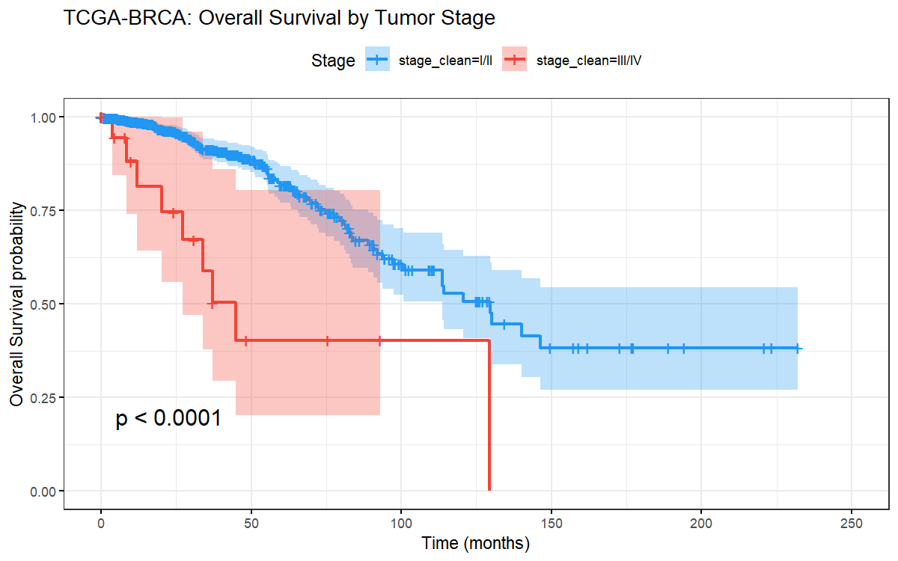
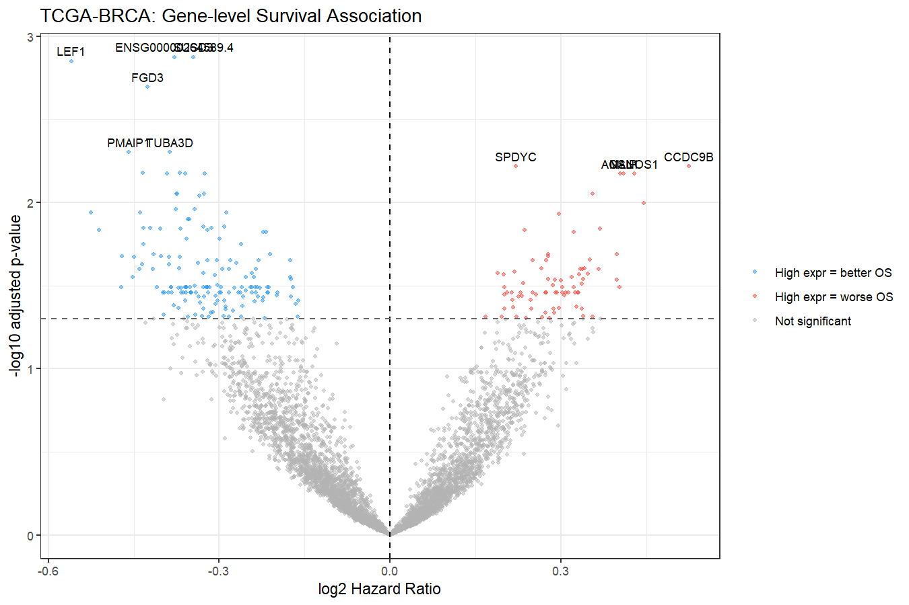
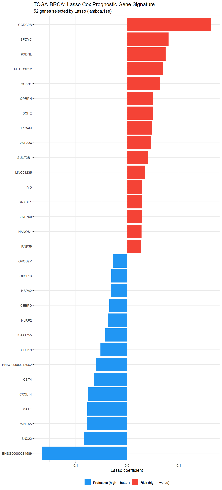
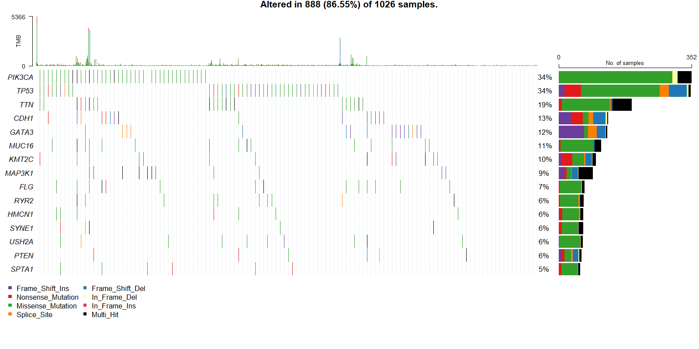
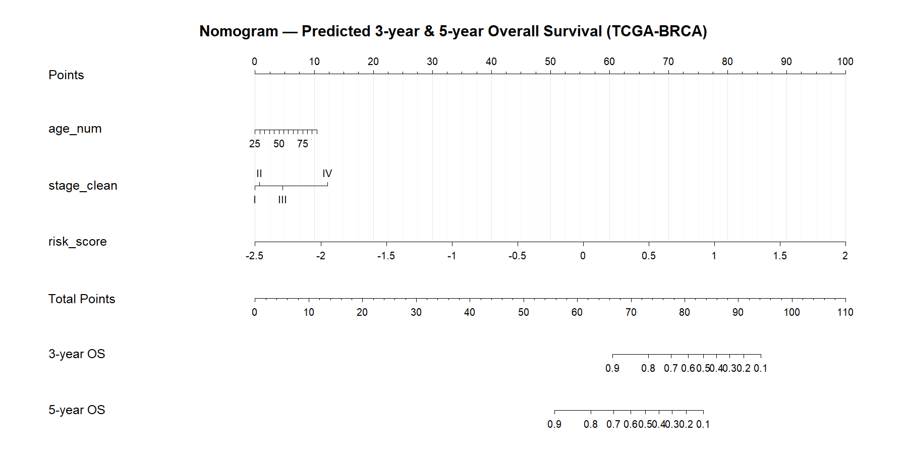
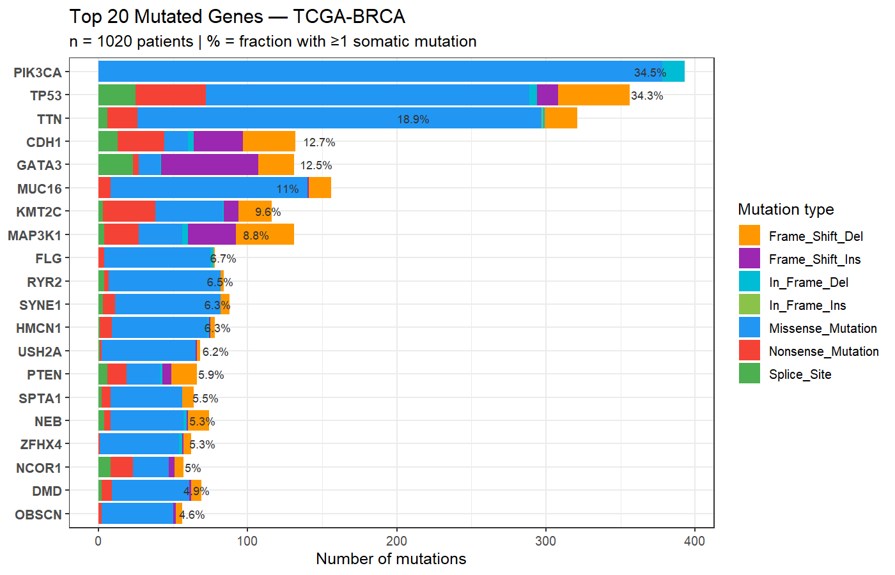

# TCGA-BRCA Survival Analysis

**A reproducible, multi-omics survival analysis pipeline for breast cancer — built in R + Python, deployed as an interactive Shiny dashboard.**

> **Template:** swap `CANCER_TYPE` in `config.R` to reuse for any TCGA cancer cohort (LUAD, COAD, GBM, …).

---

## What this project does

A complete end-to-end analysis of **1,035 breast cancer patients** from The Cancer Genome Atlas (TCGA-BRCA), combining clinical variables, RNA-seq gene expression, pathway biology, immune infiltration, and somatic mutations to identify predictors of overall survival.

| Module | Method | Key result |
|--------|--------|-----------|
| Clinical survival | Kaplan-Meier + Cox PH | Stage III/IV: HR = 3.43 vs Stage I (p < 0.001) |
| Gene screening | Univariate Cox × 5,000 genes | Top gene SUSD3: HR = 0.51 (protective) |
| Lasso signature | Penalized Cox + 10-fold CV | 52 genes selected; C-index = **0.881** on test set |
| Model validation | 70/30 split, C-index, Brier score | Combined model: C-index = 0.893; Brier −57% vs null |
| Nomogram | rms::cph + calibration | Well-calibrated 3-year and 5-year survival predictions |
| Pathway enrichment | ORA + GSEA (clusterProfiler) | Lipid metabolism + cell adhesion enriched in risk genes |
| Immune deconvolution | GSVA / ESTIMATE gene sets | Tumor purity median = 82%; immune score not prognostic in bulk BRCA |
| Somatic mutations | maftools + TCGAmutations | PIK3CA 34.5% vs TP53 34.3%; strongly mutually exclusive (p = 8.7×10⁻⁸) |

---

## Interactive Shiny Dashboard

An 8-tab dashboard lets you explore every result interactively:

- **Overview** — project summary and key stats
- **Clinical** — KM curves by stage / age / molecular subtype with forest plot
- **Gene Explorer** — search any gene, get instant KM + hazard ratio
- **Lasso** — gene signature, risk score distribution, KM by risk group
- **Validation** — C-index comparison, Brier score over time, nomogram, calibration
- **Pathways** — ORA (0 terms, explained) and GSEA dot plot + enrichment profile
- **Immune** — GSVA scores by stage/subtype, scatter vs tumor purity, KM
- **Mutations** — mutation landscape, OncoPrint, co-occurrence, TMB, KM by gene

Every tab includes a method explanation box and interpretation of the specific results.
The interface uses a custom Bootstrap 5 theme (Poppins/Quicksand typography, rounded
cards, Font Awesome pictograms) so each method reads as a self-contained, explained story.

```r
shiny::runApp("app")
```

---

## Academic write-up

A full 10-page scientific report (in German) accompanies the code:
**[`report/hausarbeit.pdf`](report/hausarbeit.pdf)** — abstract, introduction, methods,
results, discussion, limitations and conclusion, with 19 peer-reviewed references.
It is written in Quarto (`report/hausarbeit.qmd` + `report/references.bib`) and renders
to PDF via `quarto render report/hausarbeit.qmd --to pdf`.

---

## Example outputs

| | |
|---|---|
|  |  |
| KM by tumor stage (log-rank p < 0.001) | Gene-level survival volcano (5,000 genes) |
|  |  |
| 52-gene Lasso prognostic signature | OncoPrint — top 15 mutated genes |
|  |  |
| Clinical nomogram (3-year & 5-year OS) | Mutation frequency by type |

---

## Pipeline scripts

```
R/01_download.R          — GDC API download (clinical + RNA-seq HTSeq counts)
R/02_preprocess.R        — survival endpoint cleaning, gene filtering
R/03_survival_analysis.R — KM curves, log-rank, multivariable Cox
R/04_gene_survival.R     — univariate Cox × 5,000 genes, volcano plot
R/05_subtypes.R          — ER/PR/HER2 → molecular subtype, subtype Cox
R/06_lasso_cox.R         — Lasso-penalized Cox, cross-validation, risk score
R/07_enrichment.R        — ORA + GSEA (clusterProfiler / enrichplot)
R/08_immune.R            — GSVA immune/stromal deconvolution (Yoshihara 2013)
R/09_validation.R        — 70/30 split, C-index, Brier score (pec)
R/10_nomogram.R          — rms::cph nomogram + calibration plot
R/11_mutations.R         — somatic MAF, OncoPrint, co-occurrence, TMB, survival
```

---

## Requirements

**R (≥ 4.2):**
```r
BiocManager::install(c("TCGAbiolinks","SummarizedExperiment","DESeq2",
                        "clusterProfiler","enrichplot","GSVA","maftools"))
install.packages(c("survival","survminer","glmnet","rms","pec",
                   "ggplot2","dplyr","tidyr","plotly","shiny","bslib",
                   "ggpubr","gridExtra","cowplot","forcats"))
```

**Python (≥ 3.9)** *(interactive visualisations only)*:
```
pip install pyreadr plotly pandas numpy lifelines kaleido
```

---

## Quickstart

```r
# Clone repo and set working directory to repo root
source("R/01_download.R")           # ~20 min — downloads ~2 GB from GDC
source("R/02_preprocess.R")
source("R/03_survival_analysis.R")
source("R/04_gene_survival.R")      # ~10 min (5,000 Cox models)
source("R/05_subtypes.R")
source("R/06_lasso_cox.R")          # ~5 min (10-fold CV)
source("R/07_enrichment.R")
source("R/08_immune.R")
source("R/09_validation.R")
source("R/10_nomogram.R")
source("R/11_mutations.R")

# Launch dashboard
shiny::runApp("app")
```

---

## Adapting to other cancer types

Edit `config.R`:
```r
CANCER_TYPE <- "LUAD"   # lung adenocarcinoma, or COAD, GBM, OV, KIRC, …
```
Re-run the pipeline. All clinical column names are standardised via TCGAbiolinks.

---

## Methods

| Step | Method | Package |
|------|--------|---------|
| Download | GDC REST API | TCGAbiolinks |
| Normalisation | log2(CPM+1) for Cox/Lasso; VST for DESeq2 | DESeq2 |
| Survival | Kaplan-Meier, log-rank, Cox PH | survival, survminer |
| Feature selection | Lasso-penalized Cox, 10-fold CV, lambda.1se | glmnet |
| Pathway analysis | Over-representation (hypergeometric), GSEA | clusterProfiler |
| Immune deconvolution | GSVA with Yoshihara 2013 gene sets | GSVA |
| Validation | C-index (concordance), Brier score | pec |
| Nomogram | Regression Modelling Strategies | rms |
| Mutation analysis | Masked somatic MAF, OncoPrint | maftools, TCGAmutations |
| Dashboard | Modular Shiny app, Bootstrap 5 | shiny, bslib |

---

## License

MIT — free to use, adapt, and share.
