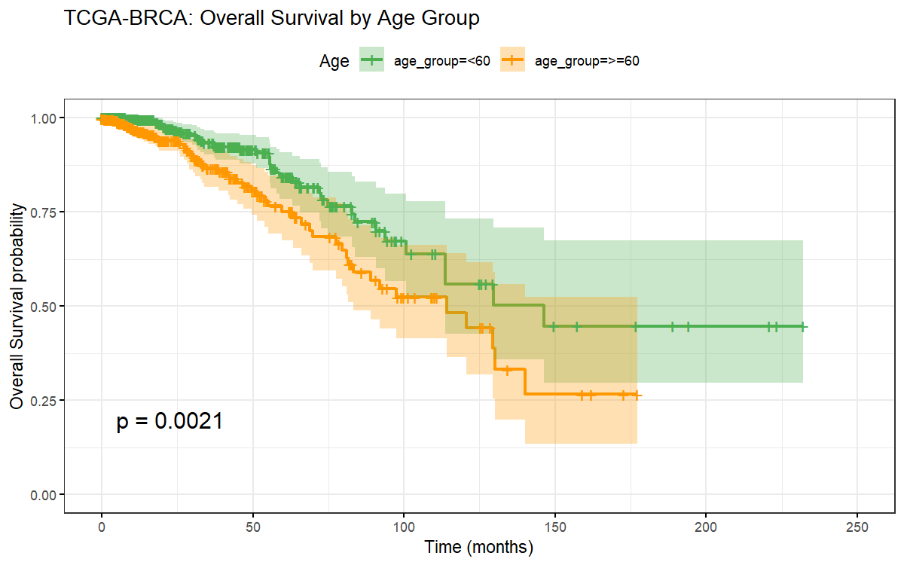
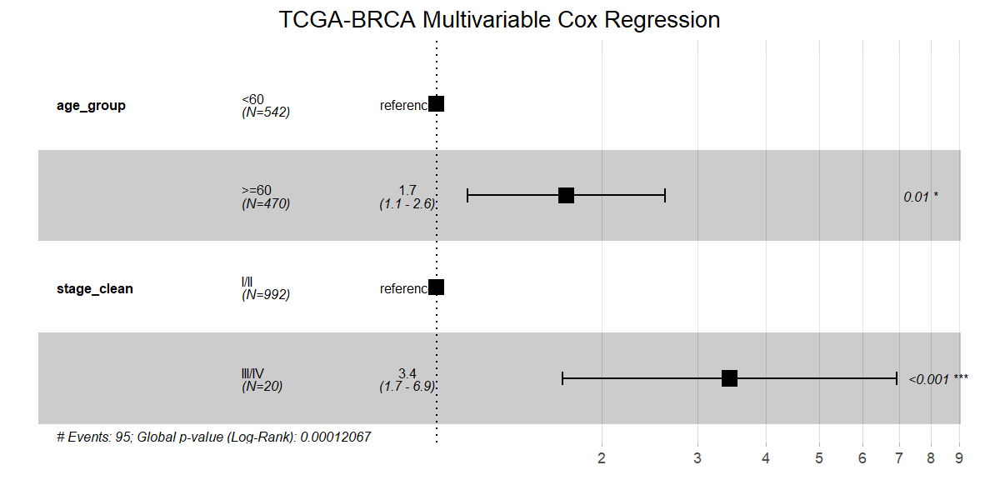
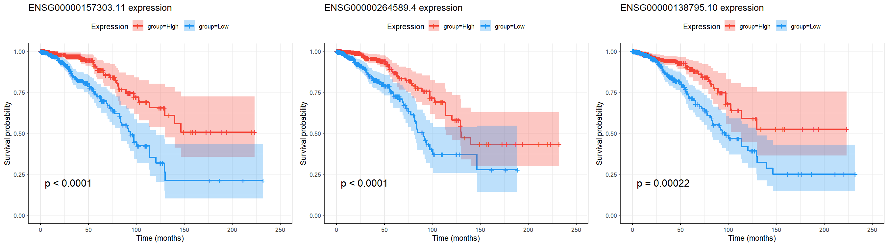

```{r setup}
#| include: false
source("../config.R")
library(survival)
library(survminer)
library(ggplot2)
library(dplyr)
library(knitr)
```

## Introduction

This report presents a reproducible survival analysis of **TCGA-BRCA**
(The Cancer Genome Atlas — Breast Invasive Carcinoma), combining clinical
covariates with RNA-seq expression data to identify predictors of overall survival.

**Key questions:**

1. Do tumor stage and patient age predict survival?
2. Which genes, when highly expressed, are associated with worse or better outcomes?

## Data

- **Source**: TCGA-BRCA via TCGAbiolinks (GDC API)
- **Clinical**: patient demographics, staging, survival endpoints
- **Molecular**: RNA-seq HTSeq counts (STAR workflow), VST-normalized

```{r load-data}
survival_df <- readRDS("../data/processed/survival_df.rds")
cox_results  <- readRDS("../results/gene_cox_results.rds")

cat("Patients with clinical data:", nrow(survival_df), "\n")
cat("Deaths (events):", sum(survival_df$OS), "\n")
cat("Median follow-up (months):",
    round(median(survival_df$OS.time / 30.44, na.rm = TRUE), 1), "\n")
```

## Clinical Survival Analysis

### Kaplan-Meier: Tumor Stage

```{r km-stage, fig.cap="Kaplan-Meier curves by AJCC tumor stage."}
knitr::include_graphics("../results/figures/km_stage.png")
```

### Kaplan-Meier: Age Group

```{r km-age, fig.cap="Kaplan-Meier curves by patient age group."}

```

### Multivariable Cox Regression

```{r cox-forest, fig.cap="Forest plot from multivariable Cox regression."}

```

```{r cox-table}
cox_res <- readRDS("../results/cox_results.rds")
s <- cox_res$summary
coef_df <- as.data.frame(s$conf.int) |>
  tibble::rownames_to_column("Covariate") |>
  dplyr::mutate(p = s$coefficients[, "Pr(>|z|)"]) |>
  dplyr::rename(HR = `exp(coef)`, Lower95 = `lower .95`, Upper95 = `upper .95`)
kable(coef_df[, c("Covariate", "HR", "Lower95", "Upper95", "p")],
      digits = 3, caption = "Multivariable Cox Regression Results")
```

## Gene-level Survival Analysis

Univariate Cox regression was run for the **5,000 most variable genes**
(VST-normalized). Each gene's hazard ratio reflects the change in death hazard
per one-unit increase in normalized expression.

### Volcano Plot

```{r volcano, fig.cap="Volcano plot: log2 HR vs. -log10 adjusted p-value."}
knitr::include_graphics("../results/figures/volcano_cox.png")
```

### Top Survival-associated Genes

```{r top-genes-table}
kable(head(cox_results[, c("gene", "hr", "lower", "upper", "pval", "padj")], 20),
      digits = c(0, 3, 3, 3, 4, 4),
      col.names = c("Gene", "HR", "95% CI Lower", "95% CI Upper", "p-value", "adj. p-value"),
      caption = "Top 20 survival-associated genes (univariate Cox, BH-adjusted)")
```

### KM Curves for Top Genes

```{r km-genes, fig.cap="KM curves for top 3 survival-associated genes (high vs. low expression)."}

```

## Methods Summary

| Step | Tool | Details |
|------|------|---------|
| Data download | TCGAbiolinks | GDC API, STAR counts |
| Normalization | DESeq2 VST | Variance-stabilizing transform |
| Survival analysis | survival, survminer | KM, log-rank, Cox PH |
| Gene screening | 5000 most variable | Univariate Cox per gene |
| Multiple testing | BH correction | FDR < 5% |
| Interactive viz | Python + Plotly | lifelines KM, scatter |

## Reproducibility

All code available at: [github.com/YOUR_USERNAME/tcga-survival-analysis](https://github.com)

```r
# Reproduce this analysis:
source("R/01_download.R")    # ~20 min (data download)
source("R/02_preprocess.R")  # ~2 min
source("R/03_survival_analysis.R")  # ~1 min
source("R/04_gene_survival.R")      # ~10 min (5000 Cox models)
# python python/01_interactive_viz.py
# quarto render report/report.qmd
```

## Session Info

```{r session-info}
sessionInfo()
```
